# 北京高考本科普通批投档线数据

> Beijing Gaokao Undergraduate Admission Scores (Regular Batch)

## 数据说明

本仓库收录 **北京市高考本科普通批录取投档线** 数据，数据来源为北京教育考试院官方发布。

| 年份 | 记录数 | 发布日期 | 说明 |
|------|--------|----------|------|
| 2023 | 1,301  | 2023-07-17 | 含院校代码、专业组、选考要求、投档线 |
| 2024 | 1,258  | 2024-07-20 | 含院校代码、专业组、选考要求、投档线 |
| 2025 | 1,391  | 2025-07-20 | 含院校代码、专业组、选考要求、投档线 |
| 2026 | 1,597  | 2026-07-20 | 含院校代码、专业组、选考要求、投档线 |

**总计：5,547 条记录**

## 文件结构

```
data/
├── 2023.csv                      # 2023 年投档线
├── 2024.csv                      # 2024 年投档线
├── 2025.csv                      # 2025 年投档线
├── 2026.csv                      # 2026 年投档线
└── beijing-admission-scores.csv  # 全量合并表（2023-2026）
```

## 字段说明

| 字段 | 英文 | 说明 |
|------|------|------|
| 年份 | `year` | 高考年份 |
| 序号 | `seq` | 官方公布序号 |
| 院校代码 | `school_code` | 教育部统一院校代码 |
| 院校名称 | `school_name` | 院校全称 |
| 专业组 | `major_group` | 院校专业组代码（如 01, 02） |
| 选考要求 | `selection_requirement` | 该专业组选考科目要求 |
| 总分 | `score` | 投档最低分 |
| 备注 | `remark` | 含单科成绩、特殊要求等 |

### 选考要求取值示例

- `不限` — 无选考科目限制
- `物理＋化学` — 必选物理和化学
- `物理` — 必选物理
- `思想政治` — 必选思想政治
- `历史` — 必选历史
- `物理＋化学(中外合办)` — 中外合作办学，选考要求物理+化学
- `不限(中外合办)` — 中外合作办学，无选考限制

> **注意**：2023 年数据原始格式使用 `/` 分隔选考科目，本数据集已统一规范为 `＋`。

## 使用示例

### Python + pandas

```python
import pandas as pd

df = pd.read_csv("data/beijing-admission-scores.csv")
# 查看 2025 年清华北大投档线
df[(df['year'] == 2025) & (df['school_name'].str.contains('清华|北大'))]
```

### SQLite

```bash
sqlite3 gaokao.db ".mode csv" ".import data/beijing-admission-scores.csv admission_scores"
```

## 数据更新计划

- [x] 2023 年
- [x] 2024 年
- [x] 2025 年
- [x] 2026 年
- [ ] 2027 年（待官方发布）
- [ ] …… 持续更新

## 数据分析

### 录取记录数变化趋势

四年间录取记录从 2023 年的 1,301 条增长至 2026 年的 1,597 条，增幅约 23%。2024 年略有下降后，2025-2026 年显著回升。

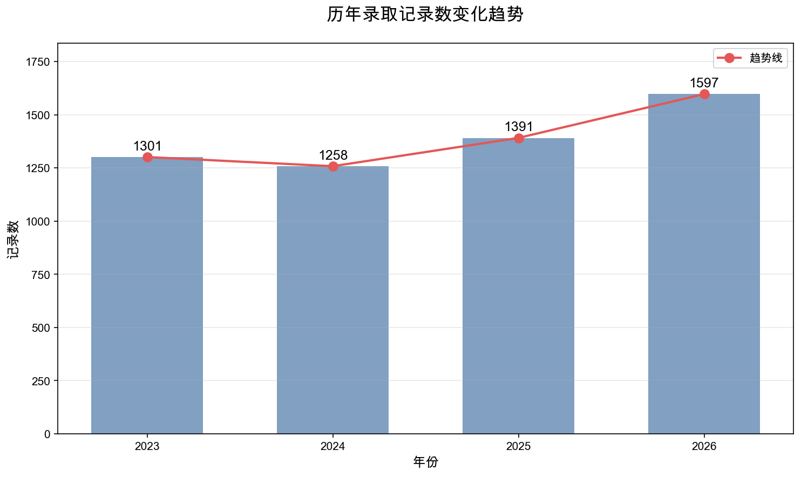

### 投档分数分布对比

各年度投档分数分布叠加对比。整体分布呈右偏态，集中在 450-600 分区间。2026 年高分段（680+）人数有所减少。

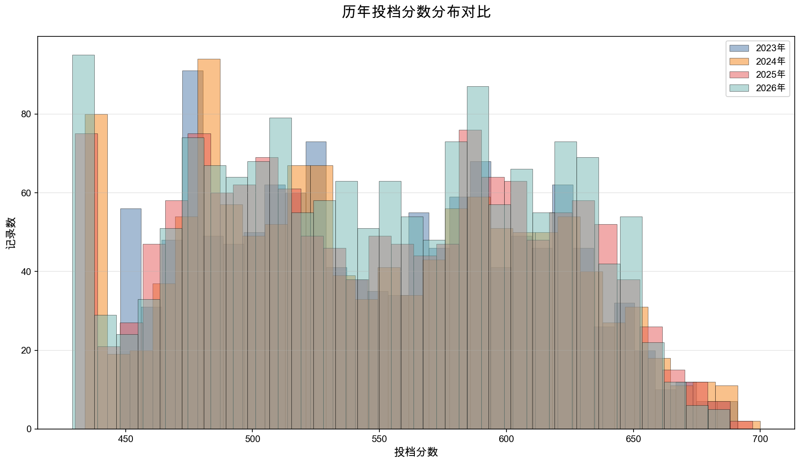

### 顶尖高校投档线趋势

北京大学、清华大学、中国人民大学、北京航空航天大学、北京师范大学五所顶尖高校的投档线走势。2024-2025 年达到峰值后，2026 年普遍回落 2-6 分。

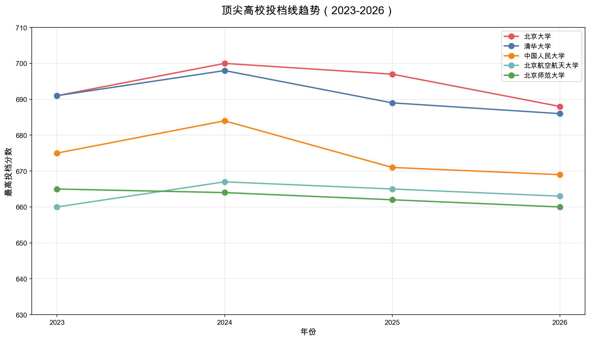

### 2026 年选考要求分布

2026 年数据中，选考要求分布情况。物理＋化学组合占比最高（37.3%），其次是不限（30.8%），反映理工科专业的主导地位。

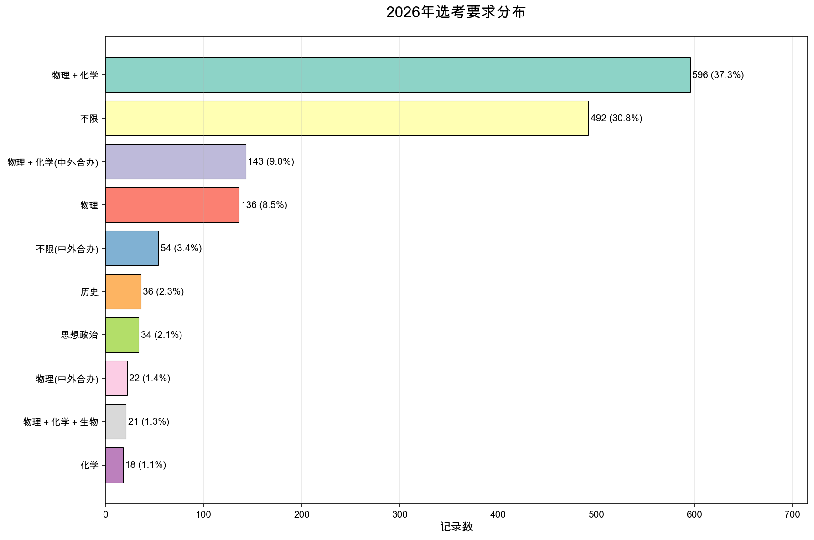

### 北京高校 vs 外地高校

对比北京本地高校与外地高校的投档分数分布。北京高校平均投档线略高于外地高校，但外地顶尖学校（如复旦、交大）分数同样具有竞争力。

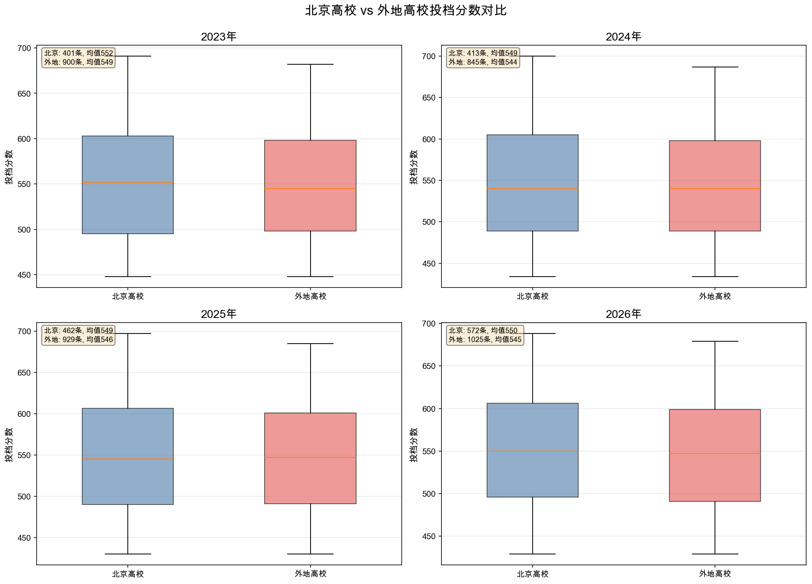

### 分数段分布演变

各分数段记录数的堆叠柱状图，展示四年间分数结构的演变。650+ 高分段在 2026 年占比下降，500-619 中段占比上升。

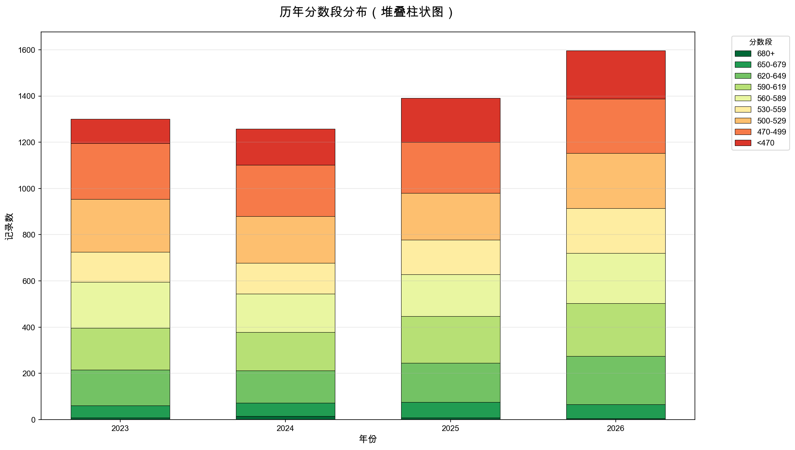

### 招生版图变化

四年间每年新增和退出招生的学校数量。招生总盘持续扩大，2026 年新增 21 所学校（如国防科技大学、香港城市大学(东莞)、厦门大学(马来西亚分校)等）。

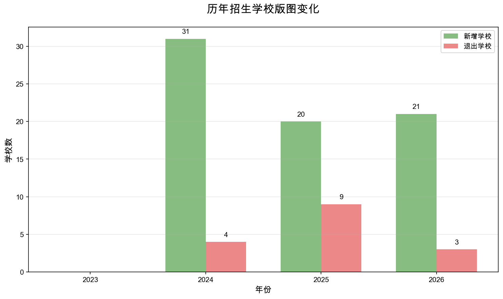

### 专业组数量变化

专业组数量从 2023 年的 1,301 个增长至 2026 年的 1,597 个，增幅约 23%。反映高校招生精细化趋势——更多院校拆分为更细的专业组。

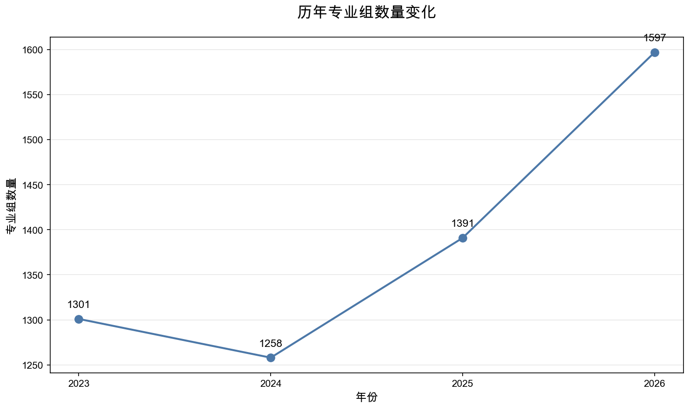

### 持续升温/降温的学校

四年连续上涨或下降的学校各约 45-49 所。上涨代表（如南京工程学院 +75 分、北京信息科技大学 +67 分）多为工科院校，降温代表（如贵州财经大学 -76 分）多为财经类院校，反映近年专业热度向理工科迁移。

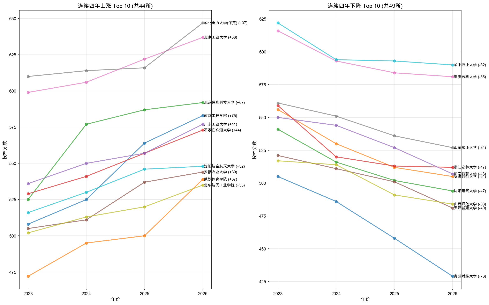

### 断档风险学校

投档线四年标准差最大的学校，分数波动剧烈，存在大小年效应或招生计划调整，志愿填报需谨慎评估。

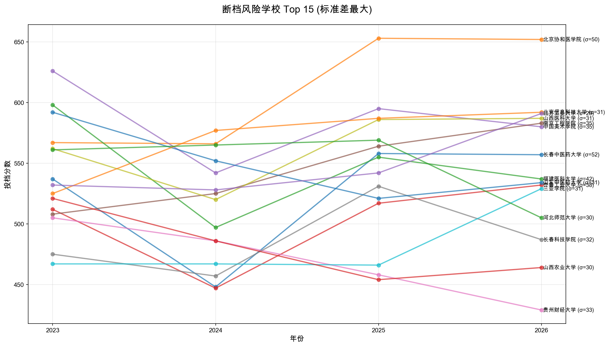

### 专业组分差

同一学校内不同专业组间的投档分差，反映专业冷热差距。医药类院校分差普遍较大（北京中医药大学 103 分、中国医科大学 102 分），护理/基础医学等专业组明显低于临床医学。

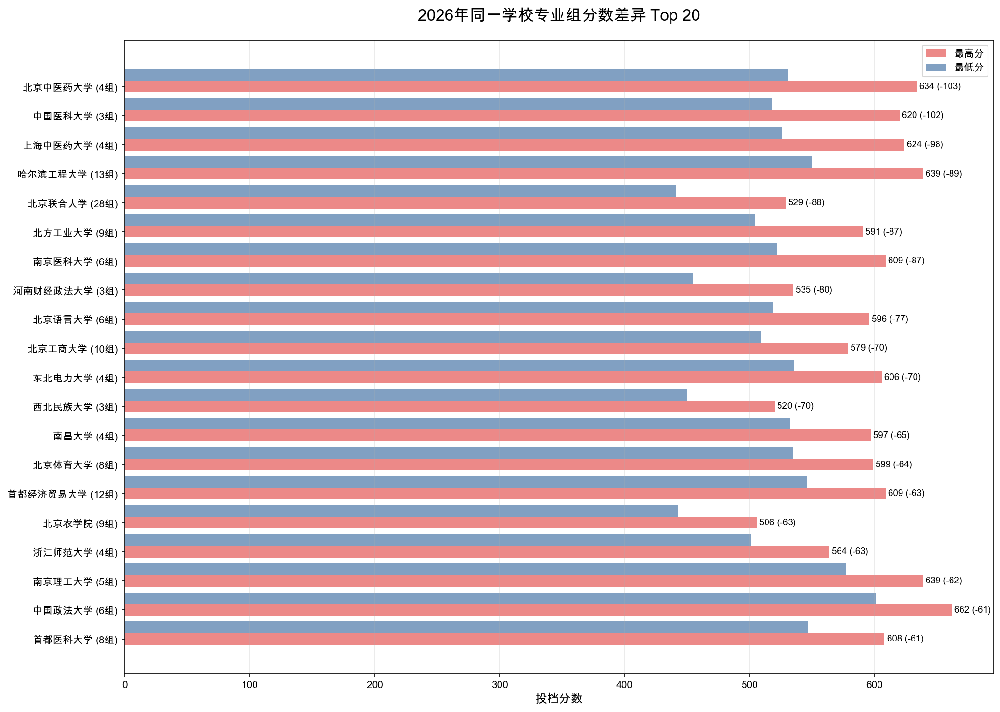

## 数据来源

数据来源于 [北京教育考试院](https://www.bjeea.cn/) 官方发布。

| 年份 | 发布日期 | 来源链接 |
|------|----------|----------|
| 2023 | 2023-07-17 | [通知公告](https://www.bjeea.cn/html/gkgz/tzgg/2023/0717/84120.html) |
| 2024 | 2024-07-20 | [通知公告](https://www.bjeea.cn/html/gkgz/tzgg/2024/0720/85632.html) |
| 2025 | 2025-07-20 | [PDF 文件](https://www.bjeea.cn/uploads/soft/250720/178-250H0201058.pdf) |
| 2026 | 2026-07-20 | [PDF 文件](https://www.bjeea.cn/uploads/soft/260720/2026%E5%B9%B4%E5%8C%97%E4%BA%AC%E5%B8%82%E9%AB%98%E6%8B%9B%E6%9C%AC%E7%A7%91%E6%99%AE%E9%80%9A%E6%89%B9%E5%BD%95%E5%8F%96%E6%8A%95%E6%A1%A3%E7%BA%BF.pdf) |

> 注：每年投档线通常在 7 月 20 日前后发布。

## 许可证

本数据集采用 [CC BY 4.0](LICENSE) 许可证发布。

您可以自由：**共享**、**改编**，但需**署名**并**注明变更**。

## 免责声明

本数据仅供学习研究和志愿填报参考，不构成任何报考建议。正式填报请以北京教育考试院官方发布为准。
